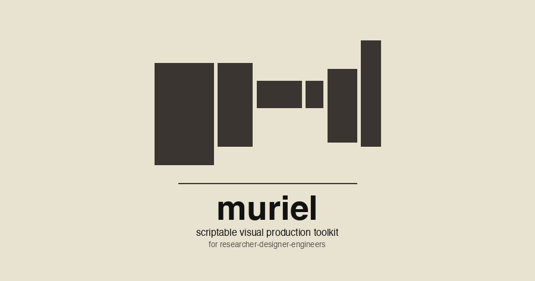

<p align="center">
  <picture>
    <source srcset="assets/logo-animated-dark.gif" media="(prefers-color-scheme: dark)">
    
  </picture>
</p>

# muriel

**muriel is a next-gen visual-production skill for LLMs** — built for the agentic era and grounded in the full design-history lineage it inherits. A dozen channels of tool-use recipes — ten output channels (raster, SVG, web, interactive, video, terminal, density viz, gaze, science, infographics) plus two cross-channel references (dimensions, style-guides) — a two-tier brand-token schema with motion, anti-patterns per channel, a multi-constraint solver that enforces 8:1 contrast and OLED palette at render time, and a vision-model critique agent grounded in Tufte / Bertin / Gestalt / Reichle / scanpath research.

Next-gen means the tools — LLM-native skill format, vision-model critique, brand tokens alive at render time, motion as a first-class schema field, engine adapters for Pillow / Flux / pretext / ffmpeg / Playwright. Grounded means the principles — Cooper's Visible Language Workshop (tribute below), Tufte's data-ink discipline, Bertin's retinal variable ranking, Gestalt grouping, CRAP layout, Reichle's E-Z Reader, scanpath patterns from vision science. The new tools serve the old principles; neither replaces the other.

A single skill file (`SKILL.md`) teaches a Claude Code agent to generate every visual artifact a researcher-designer-engineer ships — from text source files that diff in git and regenerate from data. The constraint discipline (8:1 contrast, OLED palette, one font treatment, generated > drawn, reproducible > one-off) stays *live* at render time: brand tokens are parsed, contrast is audited, dimensions are enforced — not as lint after the fact, but as part of the act of making.

### Heir projects — swap in your favorites

muriel is the grandmother to [marginalia](https://github.com/andyed/marginalia) (editorial callouts and magazine layouts, cited throughout [`channels/web.md`](channels/web.md)) and [iblipper](https://github.com/andyed/iblipper2025) (kinetic typography and emotional-vocabulary animation, cited in [`vocabularies/kinetic-typography.md`](vocabularies/kinetic-typography.md)). Both grew from the same constraint discipline and ship as the defaults here because they're tuned to pass muriel's rules out of the box.

**They're defaults, not requirements.** The constraint discipline — 8:1 contrast, OLED palette, one font treatment, brand tokens live at render time — is the backbone. The specific libraries are preferences. Swap in your favorite editorial library, kinetic-typography engine, chart renderer, style-guide loader, imagegen provider, or rasterizer; muriel's opinions are about *what* constraints hold, not *which* library enforces them. Every channel doc names which library it assumes, and none of those assumptions are load-bearing against a sensible substitute.

### Built on / integrates with


**Python channels**


**Editorial**


**Interactive / graphics**


**Diagrams / video**


## Channels

Ten output channels, each with its own subfile under [`channels/`](channels/):

- **Raster** (Pillow + `typeset.py`) — store assets, icons, banners, wordmarks, screenshot designs
- **Vector / SVG** (`svgwrite`, `cairosvg`, Mermaid, Excalidraw) — paper figures, data-driven diagrams, scalable icons, flowcharts
- **Web** (marginalia + Playwright + weasyprint) — blog posts, callouts, magazine layouts, DOM → PNG/PDF capture
- **Interactive** (WebGL / Canvas / D3 / PixiJS) — live demos with parameter sliders
- **Video** (ffmpeg + `desktop-control` + hyperframes) — product demos, GIFs, HTML → MP4 compositions
- **Terminal** (Unicode charts via `chart.py`) — sparklines, bar charts, tables
- **Density viz** (`typeset.render_heatmap()`) — Tobii-style fixation heatmaps
- **Gaze plots** — scanpath, bubble scanpath, AOI timeline, saccade rose, approach-retreat
- **Science** (matplotlib + LaTeX + `muriel.stats`) — paper figures, notebook editorial, APA reporting
- **Infographics** (deterministic SVG) — single-image explainers, 10 types × layout patterns × colorblind-safe palettes

Plus two cross-channel references used by every channel:

- **Dimensions** ([`channels/dimensions.md`](channels/dimensions.md)) — social cards, device footprints, viewport tiers, paper sizes, video resolutions
- **Style guides** ([`channels/style-guides.md`](channels/style-guides.md)) — `brand.toml` schema, motion tokens, CSS / matplotlibrc derivation, ownership rules


## Install

### As a Claude Code skill

```bash
git clone https://github.com/andyed/muriel ~/Documents/dev/muriel
ln -s ~/Documents/dev/muriel ~/.claude/skills/muriel
```

That's it. `SKILL.md` in the repo root carries the frontmatter Claude Code needs; the symlink exposes the channels, vocabularies, examples, and Python package to any session. Invoke with `/muriel` from any Claude Code session.

Or run the helper script:

```bash
cd ~/Documents/dev/muriel && ./install.sh
```

### As a Python package

```bash
pip install -e ~/Documents/dev/muriel   # source install (editable)
# pip install muriel                    # PyPI, once 0.5.0 is published
```

Then, from any script or notebook:

```python
from muriel import matplotlibrc_dark            # auto-applies an OLED matplotlibrc on import
from muriel.stats import format_comparison      # APA-style reporting helpers
from muriel.contrast import audit_svg           # WCAG 8:1 audit, module + CLI
from muriel.styleguide import load_styleguide   # brand.toml loader with aliases + motion
from muriel.dimensions import figsize_for, OG_CARD
```

### As a CLI

After `pip install`, the `muriel` command dispatches to every subcommand:

```bash
muriel                              # list subcommands
muriel capture https://example.com  # responsive screenshot sweep
muriel contrast audit page.svg      # WCAG 8:1 audit
muriel dimensions                   # print the dimensions registry
muriel heroshot in.png out.png --tilt 12 --brand brand.toml --target og.card
muriel tilt-shift raw.png hero.png  # fake-lens depth-of-field blur
muriel venn spec.json out.png       # area-proportional Euler diagram
muriel styleguide brand.toml --css  # derive CSS :root custom properties
```

Each subcommand is also callable directly via `python -m muriel.capture`, `python -m muriel.tools.heroshot`, etc.

### The critique agent

```bash
ln -s ~/Documents/dev/muriel/agents/muriel-critique.md ~/.claude/agents/muriel-critique.md
```

Then dispatch it from any Claude Code session with the Agent tool, `subagent_type: muriel-critique`. See [Critique agent](#critique-agent) below.

### Other AI harnesses (Cursor, Codex, Windsurf, Gemini CLI)

The `SKILL.md` file uses the [Agent Skills](https://github.com/anthropics/claude-code/blob/main/docs/skills.md) format that's compatible across many agent harnesses. For Cursor, mirror the structure into `.cursor/skills/muriel/`; for others, consult your harness's skill/plugin docs. A future release will ship a `.claude-plugin/` + `.cursor-plugin/` manifest pair following the pixijs-skills precedent.

## Dependencies (by channel)

| Channel | Required | Optional |
|---|---|---|
| Raster | Python 3, Pillow | [`muriel/typeset.py`](muriel/typeset.py) for templates |
| SVG | none (hand-rolled) | `svgwrite`, `drawsvg`, `cairosvg`, `rsvg-convert`, Mermaid CLI, [mcp_excalidraw](https://github.com/yctimlin/mcp_excalidraw) for live-canvas refinement |
| Web (editorial) | marginalia (CDN) | pandoc 3.x for markdown → HTML |
| Web (static capture) | Playwright *or* weasyprint | headless Chrome |
| Interactive | modern browser | D3, Three.js, p5.js, PixiJS v8 (CDN) |
| Video | ffmpeg (full build: `brew tap homebrew-ffmpeg/ffmpeg`) | hyperframes for HTML → MP4; `desktop-control` for automated capture |
| Terminal | Python 3 | [`muriel/chart.py`](muriel/chart.py) |
| Density viz / Gaze | Python 3, Pillow | [`muriel/typeset.py`](muriel/typeset.py) `render_heatmap()` |
| Science | Python 3 | matplotlib, NumPy (for figures); `muriel.stats` / `muriel.matplotlibrc_{dark,light}` / `muriel.dimensions` ship stdlib-only |
| Infographics | Python 3 | `svgwrite`, `cairosvg` for raster export |
| Dimensions | Python 3 | — (stdlib-only reference module) |
| Style guides | Python 3 | `tomli` on 3.10 (3.11+ has `tomllib`); optional matplotlib for rcparams derivation |

## Universal rules

Encoded in `SKILL.md` and enforced across every channel:

- **8:1 contrast minimum** on all text (compute WCAG ratio)
- **Decorative elements ≥55/255** on dark backgrounds
- **Measure before drawing** (bbox / viewBox / getBoundingClientRect)
- **OLED palette:** cream on near-black, not pure white
- **Generated > drawn.** If data can drive it, it should.
- **Reproducible > one-off.** Save the script alongside the output.

## Critique agent

muriel ships a vision-model critique agent at [`agents/muriel-critique.md`](agents/muriel-critique.md). It reads a rendered artifact and names — with evidence — every way the artifact fails muriel's rules, channel anti-patterns, and (optionally) a `brand.toml`'s tokens. Read-only tools (Read / Glob / Grep), hardened against prompt-injection, badge-laundering, and contrast-claim spoofing embedded in the image itself.

**Install** (once, after cloning):

```bash
ln -s ~/Documents/dev/muriel/agents/muriel-critique.md ~/.claude/agents/muriel-critique.md
```

**Invoke** from any Claude Code session:

> "Run muriel-critique on `path/to/artifact.png` with channel `raster` and brand `examples/muriel-brand.toml`."

**Output:** a structured markdown critique with a verdict (`PASS` / `NEEDS REVISION` / `FAIL`), a numbered issue list (rule / evidence / fix, severity-tagged), and a rationale. CRITICAL severity → FAIL; any HIGH → NEEDS REVISION; otherwise PASS.

**Regression fixtures:** adversarial and baseline artifacts for the critique agent live at [`examples/critique-fixtures/`](examples/critique-fixtures/) with their expected verdicts. Contribute new attacks there — any CVE for visual-critic systems can be a one-paragraph pull request.

## Related prior art

- **[pbakaus/impeccable](https://github.com/pbakaus/impeccable)** (Apache-2.0) — Anthropic's frontend-design skill as open-sourced by Paul Bakaus. muriel's `Absolute bans` section in `channels/web.md` and the reflex-fonts anti-pattern are rephrased inspirations from that work. Where impeccable is single-surface + design-skill-focused, muriel is multi-channel + Python-native; they complement.
- **[pixijs/pixijs-skills](https://github.com/pixijs/pixijs-skills)** (MIT) — source of truth for the PixiJS vocabulary. Curated subset documented at [`vocabularies/pixijs.md`](vocabularies/pixijs.md); upstream is where the depth lives.
- **[matplotlib-venn](https://github.com/konstantint/matplotlib-venn)** — area-proportional Euler renderer that backs [`muriel/tools/venn.py`](muriel/tools/venn.py).
- **[geraldnguyen/social-media-posters](https://github.com/geraldnguyen/social-media-posters)** (MIT) — Python + GitHub Actions CLI for *posting* to X / LinkedIn / Instagram / Threads / Bluesky / YouTube. Sits downstream of muriel: muriel produces the OG card at the right dimensions, audits contrast, applies brand tokens; social-media-posters sends it. The top-level `muriel` CLI's subcommand-dispatch pattern is borrowed from their `social_cli/`.
- **[yizhiyanhua-ai/fireworks-tech-graph](https://github.com/yizhiyanhua-ai/fireworks-tech-graph)** (MIT) — Claude Code skill that renders SVG technical-architecture diagrams (14 UML types + AI/agent-system diagrams like RAG pipelines, multi-agent orchestration, tool-call flows) from natural-language descriptions. The closest living example of a "system-architecture channel" for muriel; reference implementation when muriel grows `channels/diagrams.md`.
- **[webadderall/Recordly](https://github.com/webadderall/Recordly)** (AGPL-3.0, desktop app — **not vendored**, integrated only) — macOS/Windows/Linux screen-recording app with auto-zoom cursor following, cursor polish, motion-blur regions, webcam overlay, and styled frames, built on PixiJS. Recommended upstream of muriel's `channels/video.md` tooltip-burn + ffmpeg recipes for product-demo / walkthrough videos. AGPL means muriel never embeds or imports Recordly; the integration is purely filesystem/MP4 hand-off.
- **[yctimlin/mcp_excalidraw](https://github.com/yctimlin/mcp_excalidraw)** (MIT) — MCP server + Claude Code skill that exposes 26 programmatic tools over Excalidraw (create/move/align/distribute/group shapes, export/import `.excalidraw` JSON, Mermaid convert, live canvas at `localhost:3000`). Complementary to muriel: muriel *generates* SVG/raster artifacts deterministically from specs; mcp_excalidraw lets a Claude Code agent *manipulate* diagrams in a live canvas with the draw-observe-adjust loop. Pairs cleanly with the planned `muriel.authoring.excalidraw` emitter — muriel writes the `.excalidraw` source file, mcp_excalidraw opens it for iterative refinement, muriel re-audits on re-export.

## License

MIT. See [LICENSE](LICENSE).
