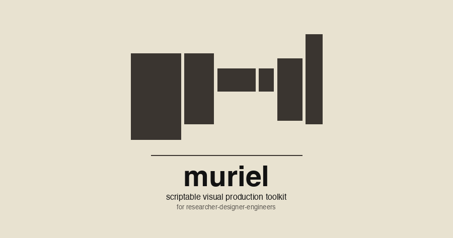

<p align="center">
  <picture>
    <source srcset="assets/logo-animated-dark.gif" media="(prefers-color-scheme: dark)">
    
  </picture>
</p>

# muriel

**muriel is a Claude Code skill that produces visual artifacts across sixteen channels — fourteen output + two cross-channel references — enforcing an 8:1 contrast floor and brand-token discipline at render time.** Design tokens import from `design.md` and export to W3C DTCG; a vision-model critique agent audits the output; the floor never bends.

A single skill file (`SKILL.md`) teaches the agent to generate every visual artifact a researcher-designer-engineer ships — from text source files that diff in git and regenerate from data. The constraint discipline (8:1 contrast, OLED palette, one font treatment, generated > drawn, reproducible > one-off) stays *live* at render time: brand tokens are parsed, contrast is audited, dimensions are enforced — not as lint after the fact, but as part of the act of making.

### Heir projects — swap in your favorites

muriel is the grandmother to [marginalia](https://github.com/andyed/marginalia) (editorial callouts and magazine layouts, cited throughout [`channels/web.md`](plugins/muriel/skills/compose/channels/web.md)) and [iblipper](https://github.com/andyed/iblipper2025) (kinetic typography and emotional-vocabulary animation, cited in [`vocabularies/kinetic-typography.md`](plugins/muriel/skills/compose/vocabularies/kinetic-typography.md)). Both grew from the same constraint discipline and ship as the defaults here because they're tuned to pass muriel's rules out of the box.

**They're defaults, not requirements.** The constraint discipline — 8:1 contrast, OLED palette, one font treatment, brand tokens live at render time — is the backbone. The specific libraries are preferences. Swap in your favorite editorial library, kinetic-typography engine, chart renderer, style-guide loader, imagegen provider, or rasterizer; muriel's opinions are about *what* constraints hold, not *which* library enforces them. Every channel doc names which library it assumes, and none of those assumptions are load-bearing against a sensible substitute.

### Built on / integrates with


**Python channels**


**Editorial**


**Interactive / graphics**


**Diagrams / video**


## Channels

Fourteen output channels, each with its own subfile under [`channels/`](plugins/muriel/skills/compose/channels/):

- **Raster** (Pillow + `typeset.py`) — store assets, icons, banners, wordmarks, screenshot designs
- **Vector / SVG** (`svgwrite`, `cairosvg`, Mermaid, Excalidraw) — paper figures, data-driven diagrams, scalable icons, flowcharts
- **Web** (marginalia + Playwright + weasyprint) — blog posts, callouts, magazine layouts, DOM → PNG/PDF capture
- **Interactive** (WebGL / Canvas / D3 / PixiJS) — live demos with parameter sliders, sci-fi UI scaffolds
- **Video** (ffmpeg + `desktop-control` + hyperframes) — product demos, GIFs, HTML → MP4 compositions
- **Terminal** (Unicode charts via `chart.py`) — sparklines, bar charts, tables
- **Density viz** (`typeset.render_heatmap()`) — Tobii-style fixation heatmaps
- **Gaze plots** — scanpath, bubble scanpath, AOI timeline, saccade rose, approach-retreat
- **Science** (matplotlib + LaTeX + `muriel.stats`) — paper figures, notebook editorial, APA reporting
- **Charts** (Recharts / ECharts / Chart.js / Plotly / D3) — JS chart-library guidance with 22 numbered rules, anti-pattern detection, and muriel-strict 8:1 color tokens. matplotlib lives in **Science**. See [`channels/charts.md`](plugins/muriel/skills/compose/channels/charts.md).
- **Infographics** (deterministic SVG) — single-image explainers, 10 types × layout patterns × colorblind-safe palettes
- **Diagrams** (deterministic SVG) — rhetorical primitives: 2×2 matrix, N-step cycle, Venn shipped, plus Mermaid → SVG/ASCII and TeX → SVG (MathJax) Node-bridges; comparison pair, funnel, stack, DAG, spectrum, pyramid, heat-grid queued. Each preset carries an epistemic precondition + anti-prescription
- **Spatial** (`muriel.spatial` + `render_assets/`) — depth scaffolding for layered typography + scalar-field topology. Static SVG perspective grids (1pt / 2pt / 3pt / iso) where `grid()` scaffolds *space*, plus `ridgemap()` — a sibling primitive that scaffolds *scalar fields* as stacked 1D slices (Joy Division / Harold Craft 1970 pulsar plot lineage). Three.js + CSS3DRenderer exemplars share one helper lib. Cooper VLW / Mackinlay-Robertson-Card / Dumais Data Mountain lineage. See [`channels/spatial.md`](plugins/muriel/skills/compose/channels/spatial.md).
- **Polish** (CSS / TSX / HTML micro-interaction discipline) — UI polish + visual-detail rules: concentric border radius (`outer = inner + padding`), optical alignment, shadows-over-borders, scale-on-press (`0.96`, never below `0.95`), contextual icon animations (`scale 0.25→1` + `blur 4px→0` + `bounce: 0`), 40×40px hit area, no `transition: all`, tabular nums, `text-wrap: balance` / `pretty`, macOS font smoothing. 16 numbered rules, mined from [thedavidmurray/claude-make-interfaces-feel-better](https://github.com/thedavidmurray/claude-make-interfaces-feel-better) (MIT, archived) with muriel's 8:1 contrast floor still binding. See [`channels/polish.md`](plugins/muriel/skills/compose/channels/polish.md).

Plus two cross-channel references used by every channel:

- **Dimensions** ([`channels/dimensions.md`](plugins/muriel/skills/compose/channels/dimensions.md)) — social cards, device footprints, viewport tiers, paper sizes, video resolutions
- **Style guides** ([`channels/style-guides.md`](plugins/muriel/skills/compose/channels/style-guides.md)) — `brand.toml` schema, motion tokens, CSS / matplotlibrc derivation, ownership rules. Round-trips through Google Stitch `design.md` import (`muriel import`) and W3C Design Tokens (DTCG) export (`muriel export-dtcg`), so brand.toml plugs into `style-dictionary`, theo, Figma tokens-studio, token-css, and the iOS / Android / Tailwind pipelines downstream.


## Philosophy — multi-constraint solving

muriel is a multi-constraint solver for visual production. The tooling is LLM-native (skill format, vision-model critique, brand tokens alive at render time, motion as a first-class schema field, engine adapters for Pillow / Flux / pretext / ffmpeg / Playwright). The principles are older: Cooper's Visible Language Workshop, Tufte's data-ink discipline, Bertin's retinal variable ranking, Gestalt grouping, CRAP layout, Reichle's E-Z Reader, scanpath patterns from vision science. The tools serve the principles.


## Install

> **Where things live.** The skill's canonical source is [`plugins/muriel/skills/compose/SKILL.md`](plugins/muriel/skills/compose/SKILL.md). The repo root's `.claude-plugin/` holds only `marketplace.json`; the plugin's own manifest lives at [`plugins/muriel/.claude-plugin/plugin.json`](plugins/muriel/.claude-plugin/plugin.json) (a root-level manifest isn't needed when the marketplace `source` points to a subdirectory). The committed `.agents/skills/muriel` symlink is a deliberate cross-harness bridge (see *Other AI harnesses* below), not a stray copy.

### As a Claude Code plugin (recommended)

From any Claude Code session:

```text
/plugin marketplace add andyed/muriel
/plugin install muriel@andyed-muriel
```

That's it — no clone, no symlinks. `/plugin uninstall` reverses cleanly. Invoke with `/muriel:compose` (plugin skills are namespaced; the `muriel:` prefix prevents collisions with other plugins). The `muriel-critique` subagent loads alongside the skill.

### As a Claude Code skill (developer install)

If you're working on the muriel repo itself, install from a checkout so edits show up live:

```bash
git clone https://github.com/andyed/muriel ~/Documents/dev/muriel
cd ~/Documents/dev/muriel && ./install.sh
```

The script creates exactly two directory symlinks — `plugins/muriel/skills/compose/` → `~/.claude/skills/muriel` (so the bare `/muriel` invocation keeps working) and `plugins/muriel/agents/` → `~/.claude/agents/muriel`. One symlink each is deliberate: a new channel, reference, or jury seat then appears in the live install the moment it lands in the checkout, with no re-run. Claude Code scans `~/.claude/agents/` recursively and identifies a subagent by its `name:` frontmatter rather than its path, so the single agents mount registers every seat.

The script verifies where an existing mount actually points instead of assuming that anything present is correct. A symlink it owns gets repointed automatically. A legacy per-item mount — a real directory of individual symlinks, which never picks up directories added later — is reported and left alone until you re-run with `--repair`, which moves it to `muriel.bak-<timestamp>` before replacing it. Nothing is deleted.

It refuses outright if the plugin install is already present, to avoid double-loading.

### As a Python package

```bash
pip install -e ~/Documents/dev/muriel   # source install (editable)
# pip install muriel                    # PyPI — not yet published; track via GitHub Releases
pip install https://github.com/andyed/muriel/releases/download/v0.11.0/muriel-0.11.0-py3-none-any.whl
```

Then, from any script or notebook:

```python
from muriel import matplotlibrc_dark            # auto-applies an OLED matplotlibrc on import
from muriel.stats import format_comparison      # APA-style reporting helpers
from muriel.contrast import audit_svg           # WCAG 8:1 audit, module + CLI
from muriel.styleguide import load_styleguide   # brand.toml loader with aliases + motion
from muriel.dimensions import figsize_for, OG_CARD
```

### As a CLI

After `pip install`, the `muriel` command dispatches to every subcommand:

```bash
muriel                              # list subcommands
muriel capture https://example.com  # responsive screenshot sweep
muriel contrast audit page.svg      # WCAG 8:1 audit
muriel dimensions                   # print the dimensions registry
muriel heroshot in.png out.png --tilt 12 --brand brand.toml --target og.card
muriel tilt-shift raw.png hero.png  # fake-lens depth-of-field blur
muriel venn spec.json out.png       # area-proportional Euler diagram
muriel styleguide brand.toml --css  # derive CSS :root custom properties
```

Each subcommand is also callable directly via `python -m muriel.capture`, `python -m muriel.tools.heroshot`, etc.

### The critique agent

The `muriel-critique` subagent ships with the plugin and is loaded automatically by both install paths above (plugin install and `install.sh`). Dispatch it from any Claude Code session with the Agent tool, `subagent_type: muriel-critique`. See [Critique agent](#critique-agent) below. Five jury seats ship and load the same way — `muriel-squinter` (hierarchy under blur), `muriel-thumbnail` (signal at 1/8 and 16 px), `muriel-stranger` (premise legibility, brief withheld), `muriel-forger` (counterfeit distinguishability), and `muriel-pedant` (labels, units, numeric claims) — each dispatched as `subagent_type: muriel-<seat>` and governed by [`references/jury.md`](plugins/muriel/skills/compose/references/jury.md). Seat them as subagents: evidence denial is context isolation, not a prompt instruction.

### Other AI harnesses (Cursor, Codex, Gemini CLI, GitHub Copilot, Kiro, OpenCode, Pi, Qoder, Rovo Dev, Trae, …)

The canonical `SKILL.md` at `plugins/muriel/skills/compose/SKILL.md` uses the [Agent Skills](https://github.com/anthropics/claude-code/blob/main/docs/skills.md) format that's portable across most agent harnesses. The repo ships a `.agents/skills/muriel` symlink to the canonical source — read **natively** by Codex CLI and as an **alternate path** by Cursor, Gemini CLI, GitHub Copilot, OpenCode, and Pi. Per-harness verification is unfinished; see [`HARNESSES.md`](HARNESSES.md) for the rollout plan and the verification checklist. Kiro, Qoder, Rovo Dev, and Trae need per-harness manifest shims (P1, not yet landed).

## Dependencies (by channel)

| Channel | Required | Optional |
|---|---|---|
| Raster | Python 3, Pillow | [`muriel/typeset.py`](muriel/typeset.py) for templates |
| SVG | none (hand-rolled) | `svgwrite`, `drawsvg`, `cairosvg`, `rsvg-convert`, Mermaid CLI, [mcp_excalidraw](https://github.com/yctimlin/mcp_excalidraw) for live-canvas refinement |
| Web (editorial) | marginalia (CDN) | pandoc 3.x for markdown → HTML |
| Web (static capture) | Playwright *or* weasyprint | headless Chrome |
| Interactive | modern browser | D3, Three.js, p5.js, PixiJS v8 (CDN) |
| Video | ffmpeg (full build: `brew tap homebrew-ffmpeg/ffmpeg`) | hyperframes for HTML → MP4; `desktop-control` for automated capture |
| Terminal | Python 3 | [`muriel/chart.py`](muriel/chart.py) |
| Density viz / Gaze | Python 3, Pillow | [`muriel/typeset.py`](muriel/typeset.py) `render_heatmap()` |
| Science | Python 3 | matplotlib, NumPy (for figures); `muriel.stats` / `muriel.matplotlibrc_{dark,light}` / `muriel.dimensions` ship stdlib-only |
| Infographics | Python 3 | `svgwrite`, `cairosvg` for raster export |
| Dimensions | Python 3 | — (stdlib-only reference module) |
| Style guides | Python 3 | `tomli` on 3.10 (3.11+ has `tomllib`); optional matplotlib for rcparams derivation |

## Universal rules

Encoded in `SKILL.md` and enforced across every channel:

- **8:1 contrast minimum** on all text (compute WCAG ratio)
- **Decorative elements ≥55/255** on dark backgrounds
- **Measure before drawing** (bbox / viewBox / getBoundingClientRect)
- **OLED palette:** cream on near-black, not pure white
- **Generated > drawn.** If data can drive it, it should.
- **Reproducible > one-off.** Save the script alongside the output.

## Critique agent

muriel ships a vision-model critique agent at [`plugins/muriel/agents/muriel-critique.md`](plugins/muriel/agents/muriel-critique.md). It reads a rendered artifact and names — with evidence — every way the artifact fails muriel's rules, channel anti-patterns, and (optionally) a `brand.toml`'s tokens. Read-only tools (Read / Glob / Grep), hardened against prompt-injection, badge-laundering, and contrast-claim spoofing embedded in the image itself. The jury seats differ. `muriel-squinter`, `muriel-thumbnail`, and `muriel-pedant` add Bash for their lens tools (`muriel.squint` for the first two, grep-based extraction for the third). `muriel-forger` carries Write plus a documented render escape hatch because its whole method is building a counterfeit and rendering it — its output lands under `render_assets/forgery/<decisionId>/`, which is gitignored. `muriel-stranger` holds only Read and Bash on purpose: its lens is one pass over the artifact with the brief withheld, and every additional tool is a way to lose that.

**Install:** the subagent ships with the muriel plugin and is loaded automatically by both install paths in [Install](#install) above (plugin install via `/plugin install muriel@andyed-muriel` and the developer `install.sh` route). No manual symlinks required. If `subagent_type: muriel-critique` fails to resolve, check where the mount points — `ls -la ~/.claude/agents/muriel` — and re-run `./install.sh --repair`.

**Invoke** from any Claude Code session:

> "Run muriel-critique on `path/to/artifact.png` with channel `raster` and brand `examples/muriel-brand.toml`."

**Output:** a structured markdown critique with a verdict (`PASS` / `NEEDS REVISION` / `FAIL`), a numbered issue list (rule / evidence / fix, severity-tagged), and a rationale. CRITICAL severity → FAIL; any HIGH → NEEDS REVISION; otherwise PASS.

**Regression fixtures:** adversarial and baseline artifacts for the critique agent live at [`examples/critique-fixtures/`](plugins/muriel/skills/compose/examples/critique-fixtures/) with their expected verdicts. Contribute new attacks there — any CVE for visual-critic systems can be a one-paragraph pull request.

## Showcase

- **[muriel.mindbendingpixels.com](https://muriel.mindbendingpixels.com)** — muriel's own landing page and gallery. Six "Featured work" exhibits spanning science, infographics, gaze plots, and dashboard registers; an interactive motion-tuner for the brand's duration + easing tokens; install + critique-agent docs in condensed form. Built with muriel, hosted on the mindbendingpixels subdomain. OLED palette throughout, clearing the 8:1 floor every channel doc enforces.
- **[Scrutinizer — Brand & Perceptual Tokens](https://andyed.github.io/scrutinizer-www/tokens/)** — Live page that uses muriel end-to-end: the [`scrutinizer-brand.toml`](plugins/muriel/skills/compose/examples/scrutinizer-brand.toml) StyleGuide, the [`foveal_overlay`](muriel/tools/diagrams/foveal_overlay.py) primitive (port of the in-app overlay), the [`engine_sectors_overlay`](muriel/tools/diagrams/engine_sectors_overlay.py) primitive (Blauch et al. 2026 isotropic cortical sectors), the [`palettes`](muriel/palettes.py) module (Wong / IBM / Tol), and the contrast/dimension constants. The page also exposes Scrutinizer's perceptual decay constants (SIGMA_LM, SIGMA_BY, CMF_A, etc.) for designers building peripheral-aware UI. First public artifact of the muriel + Scrutinizer integration.

## Related prior art

- **[anthropics/skills](https://github.com/anthropics/skills)** (Apache-2.0) — Anthropic's official skill monorepo. Seventeen skills covering the breadth of agent surfaces, of which seven sit in muriel's territory: **`brand-guidelines`** (Anthropic's seven brand colors + Poppins/Lora typography applied via python-pptx; the canonical example of single-palette + single-typography-pair brand application), **`theme-factory`** (ten named themes — Ocean Depths, Sunset Boulevard, Forest Canopy, Modern Minimalist, Golden Hour, Arctic Frost, Desert Rose, Tech Innovation, Botanical Garden, Midnight Galaxy — plus an "ask the user, vibe-generate a similar one" custom-theme path), **`canvas-design`** (PNG/PDF visual art with a custom `canvas-fonts` directory), **`frontend-design`** (UI/UX templates), **`web-artifacts-builder`** (HTML artifacts with React + Tailwind), **`algorithmic-art`** (p5.js generative with seeded randomness), **`slack-gif-creator`** (size-constrained animated GIFs). muriel positions on the same surface but with stricter constraints: 11 palettes vs 1, two-tier text-safe/decorative-only vs ungated, contrast-by-construction generation (`muriel.palettes.generate_for_floor()`) vs pick-from-menu, 8:1 floor vs no contrast guarantee, motion tokens in `brand.toml` vs no motion vocabulary, audit pipeline vs apply-and-ship. Anthropic ships breadth (17 skills across many domains); muriel ships depth on this one. Useful baseline to position any new muriel feature against.
- **[pbakaus/impeccable](https://github.com/pbakaus/impeccable)** (Apache-2.0, **Skill 3.1.1**, May 2026) — Paul Bakaus' open-source design skill for AI coding harnesses, extended from Anthropic's original frontend-design skill. Now ships seven domain reference files (Typography, Color & Contrast, Spatial, Motion, Interaction, Responsive, UX Writing), twenty-three `/impeccable:*` commands (`craft`, `critique`, `audit`, `polish`, `bolder`, `quieter`, `distill`, `harden`, `animate`, `colorize`, `typeset`, `layout`, …), twenty-seven deterministic anti-pattern rules plus twelve LLM-critique rules, and a standalone `npx impeccable detect` CLI (regex + Puppeteer screenshot scan, no API key required) that emits JSON for twenty-four detectable issues. Packaged across eleven harnesses (Claude Code, Cursor, Codex CLI, Gemini CLI, GitHub Copilot, Kiro, OpenCode, Pi, Qoder, Rovo Dev, Trae). muriel's `Absolute bans` section in `channels/web.md` and the reflex-fonts anti-pattern are rephrased from impeccable. Where impeccable is single-surface + JS-side and ships its own detector, muriel is multi-channel + Python-native with a vision-model critique agent; they complement — chaining `muriel capture` → `npx impeccable detect` → `muriel-critique` is the strongest pipeline for "render → static-rule scan → vision-critic" on a web surface. muriel's cross-harness rollout in [`HARNESSES.md`](HARNESSES.md) mirrors impeccable's packaging matrix.
- **[nexu-io/html-anything](https://github.com/nexu-io/html-anything)** (Apache-2.0, 4.7k★) — agentic HTML editor with ~75 surface archetypes grouped into nine families (decks, frames / motion, social cards, web prototypes, articles, office / PM docs, dashboards, posters, specialized), each rendered as single-file HTML; one-click export to PNG / WeChat / X / Zhihu. The closest contemporary to a fully-fleshed surfaces catalog — muriel cites it rather than rebuilding the taxonomy. Surveyed in [`vocabularies/surfaces.md`](plugins/muriel/skills/compose/vocabularies/surfaces.md); patterns mined include the typed frontmatter shape (`category` / `scenario` / `aspect_hint` / `featured` / `recommended` / `example_source_url`), the "absolute rules per surface" enforcement pattern (`deck-swiss-international`'s `border-radius: 0` everywhere, 22 locked layouts S01–S22, locked 4-theme palette with no hex modification), CJK-first font stacks (Latin display + `Noto Sans SC`), and the "inspired by" lineage chain shipped as data not prose. Take/keep-ours mapping in the [Sibling skills](plugins/muriel/skills/compose/SKILL.md#sibling-skills--what-we-borrow-from-each) table. Full surface implementation queued.
- **[pixijs/pixijs-skills](https://github.com/pixijs/pixijs-skills)** (MIT) — source of truth for the PixiJS vocabulary. Curated subset documented at [`vocabularies/pixijs.md`](plugins/muriel/skills/compose/vocabularies/pixijs.md); upstream is where the depth lives.
- **Claude Code bundled `dataviz` skill** (Anthropic, ships in-box) — the first first-party skill in muriel's territory to load by default (auto-triggers on "chart"/"dashboard"/"palette"). One channel, deliberately brand-neutral: its docs say to swap in your brand's palette but ship no tooling for it — which is exactly what muriel is (`brand.toml`, DTCG, contrast-by-construction). muriel is stricter (8:1 computed floor vs its relief-rule 3:1) across fifteen more channels.
- **[caylent/tufte-data-viz](https://github.com/caylent/tufte-data-viz)** (MIT) — Edward Tufte's data-viz principles as an agent skill: 22 numbered rules + per-library quick-reference for Recharts, ECharts, Chart.js, matplotlib, Plotly, D3/SVG. The structural model behind muriel's [`channels/charts.md`](plugins/muriel/skills/compose/channels/charts.md) — we ported the rule structure, per-library config tables, and anti-pattern PATTERN→FIX detection format, then overrode the color tokens because Tufte's published palette fails muriel's 8:1 floor (their `#666` series and `#e41a1c` accent score 5.7 and 4.7). Specific divergences logged in the [Sibling skills](plugins/muriel/skills/compose/SKILL.md#sibling-skills--what-we-borrow-from-each) table.
- **[K-Dense-AI/scientific-agent-skills](https://github.com/K-Dense-AI/scientific-agent-skills)** (MIT) — research-skill family covering matplotlib, statistical-analysis, scientific-critical-thinking, market-research, pptx, markitdown, literature-review, hypothesis-generation, scientific-schematics. Several modules overlap muriel's `channels/science.md` and queued channels (market-research, pptx). muriel borrows test-selection vocabulary, the generate→render→inspect PPTX inspection loop, and the GRADE/Cochrane bias taxonomy; we keep our standard-library-only `muriel.stats` (no scipy/pingouin) and 8:1 audit on every figure. Take/keep-ours mapping in the [Sibling skills](plugins/muriel/skills/compose/SKILL.md#sibling-skills--what-we-borrow-from-each) table.
- **[matplotlib-venn](https://github.com/konstantint/matplotlib-venn)** — area-proportional Euler renderer that backs [`muriel/tools/venn.py`](muriel/tools/venn.py).
- **[geraldnguyen/social-media-posters](https://github.com/geraldnguyen/social-media-posters)** (MIT) — Python + GitHub Actions CLI for *posting* to X / LinkedIn / Instagram / Threads / Bluesky / YouTube. Sits downstream of muriel: muriel produces the OG card at the right dimensions, audits contrast, applies brand tokens; social-media-posters sends it. The top-level `muriel` CLI's subcommand-dispatch pattern is borrowed from their `social_cli/`.
- **[yizhiyanhua-ai/fireworks-tech-graph](https://github.com/yizhiyanhua-ai/fireworks-tech-graph)** (MIT) — Claude Code skill that renders SVG technical-architecture diagrams (14 UML types + AI/agent-system diagrams like RAG pipelines, multi-agent orchestration, tool-call flows) from natural-language descriptions. The closest living example of system-architecture diagram generation; useful reference as muriel's [`channels/diagrams.md`](plugins/muriel/skills/compose/channels/diagrams.md) catalog grows past the matrix + cycle MVP toward causal DAG and stack primitives.
- **[webadderall/Recordly](https://github.com/webadderall/Recordly)** (AGPL-3.0, desktop app — **not vendored**, integrated only) — macOS/Windows/Linux screen-recording app with auto-zoom cursor following, cursor polish, motion-blur regions, webcam overlay, and styled frames, built on PixiJS. Recommended upstream of muriel's `channels/video.md` tooltip-burn + ffmpeg recipes for product-demo / walkthrough videos. AGPL means muriel never embeds or imports Recordly; the integration is purely filesystem/MP4 hand-off.
- **[yctimlin/mcp_excalidraw](https://github.com/yctimlin/mcp_excalidraw)** (MIT) — MCP server + Claude Code skill that exposes 26 programmatic tools over Excalidraw (create/move/align/distribute/group shapes, export/import `.excalidraw` JSON, Mermaid convert, live canvas at `localhost:3000`). Complementary to muriel: muriel *generates* SVG/raster artifacts deterministically from specs; mcp_excalidraw lets a Claude Code agent *manipulate* diagrams in a live canvas with the draw-observe-adjust loop. Pairs cleanly with the planned `muriel.authoring.excalidraw` emitter — muriel writes the `.excalidraw` source file, mcp_excalidraw opens it for iterative refinement, muriel re-audits on re-export.
- **[thedavidmurray/claude-make-interfaces-feel-better](https://github.com/thedavidmurray/claude-make-interfaces-feel-better)** (MIT, archived May 2026) — Design-engineering principles for UI polish: typography / surfaces / animations / performance split into four reference files plus a `skill.md` index. The structural model + 16 numbered rules behind muriel's [`channels/polish.md`](plugins/muriel/skills/compose/channels/polish.md) — we ported the whole rule set verbatim because the values are *tuned* (concentric `outer = inner + padding`, exact `scale(0.96)` press never below `0.95`, exact `scale 0.25→1` + `bounce: 0` for contextual icon swaps, 40×40px hit area, ~100ms stagger between semantic chunks) and overrode by adding the 8:1 contrast floor as a binding gate on top of the polish layer. Sits in a different lane from `impeccable` — impeccable runs deterministic anti-pattern detection over a rendered page; this codifies the design-engineering *recipes* you reach for when authoring the page.
- **[wrsmith108/visual-prompt-coach](https://github.com/wrsmith108/visual-prompt-coach)** (license unspecified) — Claude Code skill that converts unstructured visual requests for technical course materials into framework-informed prompts. Operationalises Dan Roam (6×6 / SQVID classification), Mayer's multimedia learning principles (coherence as removal rule, signaling as emphasis rule), C4 architecture-diagram leveling, cognitive load theory (element-count caps by audience prior knowledge), and Gestalt / CRAP for layout. Asks up to **four intake questions** (learning objective, what's shown, audience prior knowledge, constraints) before producing the prompt artifact — the exact shape muriel's queued constraint-elicitation rule landed on independently, which validates the cap. Lacks a critique / scoring layer downstream; muriel.critique provides the natural complement. Cognitive-science framing pairs with muriel's [`agents/muriel-critique.md`](plugins/muriel/skills/compose/agents/muriel-critique.md) and the queued 5-dimension critique scoring (where Mayer's coherence / signaling / contiguity could become evaluation axes).
- **[dot-Justin/teenage-engineering-ui-ux-skill](https://github.com/dot-Justin/teenage-engineering-ui-ux-skill)** (license unspecified) — Web-UI skill that generates interfaces in Teenage Engineering's visual register through *procedural rules* (proportional viewport layout, thin lowercase type, en-dashed product codes, true-black + warm-white surfaces) rather than asset replication. Frames the curator stance explicitly as **"inspired-by, not cloned"** — extracts transferable design DNA (layout logic, typographic hierarchy, color relationships) while excluding proprietary assets (logos, product drawings, brand copy). Format adopts Google Labs `DESIGN.md`. Validates the same stance muriel takes on `nexu-io/open-design` and the curator workflow in [`SKILL.md`](plugins/muriel/skills/compose/SKILL.md#sibling-skills--what-we-borrow-from-each) — useful external precedent when explaining muriel's mining ethos to a new contributor.
- **Skill-discovery indices** — Three community-curated registries useful when scoping muriel's territory or evaluating whether a domain is already covered before adding a channel: [VoltAgent/awesome-agent-skills](https://github.com/VoltAgent/awesome-agent-skills) (1000+ skills, multi-harness, the highest-signal index), [sickn33/antigravity-awesome-skills](https://github.com/sickn33/antigravity-awesome-skills) (1,400+ skills with an installer CLI), [travisvn/awesome-claude-skills](https://github.com/travisvn/awesome-claude-skills) (community-curated, Claude-focused). Most entries are pure-development or productivity skills — muriel-overlapping skills are a small minority. Use these to *discover* candidates for the [`SKILL.md`](plugins/muriel/skills/compose/SKILL.md#sibling-skills--what-we-borrow-from-each) Sibling-skills table; don't treat the indices themselves as authoritative.

## License

MIT. See [LICENSE](LICENSE).
