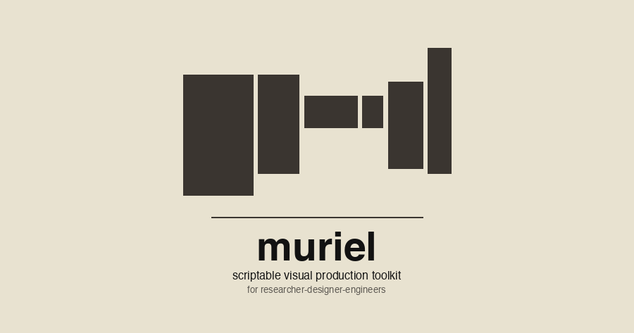

<p align="center">
  <picture>
    <source srcset="assets/logo-animated-dark.gif" media="(prefers-color-scheme: dark)">
    
  </picture>
</p>

# muriel


muriel is a design skill for coding agents. It handles the part of a task that a person will look at, such as a paper figure, a diagram, a store icon, a demo video, or a README. It helps the agent decide how that part should look, build it, and then check the rendered result.

Text must clear an 8:1 contrast ratio (WCAG AAA asks for 7:1), computed rather than eyeballed. Colors, type, and motion come from one `brand.toml`. Artifacts are generated by scripts saved next to them, so they can be rerun when the data changes. A critique subagent and a five-seat jury review the rendered image.

It runs as a Claude Code plugin or in any harness that reads the Agent Skills format. The Python package and `muriel` CLI also work without an agent. It is named after Muriel Cooper, founder of the MIT Visible Language Workshop.

Examples are in the gallery at [muriel.mindbendingpixels.com](https://muriel.mindbendingpixels.com), a site built with muriel.

## Install

In a Claude Code session:

```text
/plugin marketplace add andyed/muriel
/plugin install muriel@andyed-muriel
```

Invoke it with `/muriel:compose`, or let the agent load it when a task has an open visual decision. The critique agent and jury seats install with it. `/plugin uninstall` removes everything.

For other harnesses, the Python package, or a development checkout, see [More ways to install](#more-ways-to-install).

## Channels

A channel is one output medium. Each has a markdown file of recipes, tools, and anti-patterns under [`channels/`](plugins/muriel/skills/compose/channels/), and the agent reads the one that matches the job.

| Channel | For | Built with |
|---|---|---|
| [Raster](plugins/muriel/skills/compose/channels/raster.md) | Store assets, icons, banners, wordmarks | Pillow, `muriel.typeset` |
| [SVG](plugins/muriel/skills/compose/channels/svg.md) | Paper figures, data-driven vectors, icons, wave fields | Plain SVG; `svgwrite` and `cairosvg` optional |
| [Diagrams](plugins/muriel/skills/compose/channels/diagrams.md) | Named forms (2×2, cycle, pyramid, swimlane, Sankey, treemap, DAG, …), each with a stated test for when it fits | `muriel.tools.diagrams`; Mermaid and MathJax through Node |
| [Charts](plugins/muriel/skills/compose/channels/charts.md) | Quantitative charts in JS libraries | Recharts, ECharts, Chart.js, Plotly, D3 |
| [Science](plugins/muriel/skills/compose/channels/science.md) | Paper figures, notebook editorial, APA-style stats | matplotlib, LaTeX, `muriel.stats` |
| [Infographics](plugins/muriel/skills/compose/channels/infographics.md) | Single-image explainers | Generated SVG |
| [Web](plugins/muriel/skills/compose/channels/web.md) | Blog posts, magazine layouts, HTML to PNG or PDF | marginalia, pandoc, Playwright or WeasyPrint |
| [Interactive](plugins/muriel/skills/compose/channels/interactive.md) | Live demos with parameter controls | WebGL, Canvas, D3, PixiJS |
| [Polish](plugins/muriel/skills/compose/channels/polish.md) | UI detail: radii, press states, hit areas, icon motion | CSS, TSX, HTML |
| [Spatial](plugins/muriel/skills/compose/channels/spatial.md) | Perspective grids, layered typography, ridge plots | `muriel.spatial`, Three.js |
| [Video](plugins/muriel/skills/compose/channels/video.md) | Product demos, GIFs, HTML to MP4 | ffmpeg, hyperframes |
| [Terminal](plugins/muriel/skills/compose/channels/terminal.md) | Sparklines, bar charts, tables in Unicode | `muriel.chart` |
| [Heatmaps](plugins/muriel/skills/compose/channels/heatmaps.md) | Fixation density overlays | `muriel.typeset` |
| [Gaze](plugins/muriel/skills/compose/channels/gaze.md) | Scanpaths, AOI timelines, saccade roses | Pillow |
| [README](plugins/muriel/skills/compose/channels/readme.md) | Repo front pages rendered by GitHub | `muriel.capture`, `muriel.squint`, `muriel.aiism` |

Two references apply to every channel. [Dimensions](plugins/muriel/skills/compose/channels/dimensions.md) covers social cards, device sizes, paper, and video resolutions. [Style guides](plugins/muriel/skills/compose/channels/style-guides.md) defines the `brand.toml` schema, which imports from Google Stitch `design.md` (`muriel import`) and exports W3C design tokens (`muriel export-dtcg`).

The web and kinetic-type docs default to two sibling projects, [marginalia](https://github.com/andyed/marginalia) and [iblipper](https://github.com/andyed/iblipper2025), because they pass muriel's rules without changes. Substitute your own libraries freely. Each channel names the library it assumes, and none of the rules depend on it.

## Rules every channel enforces

From [`SKILL.md`](plugins/muriel/skills/compose/SKILL.md):

- Text contrast of at least 8:1 against its background. No opacity on text; pick an explicit color.
- Body copy and captions at 16 px or larger, body weight 500 or heavier.
- Measure text width, plot bounds, and target dimensions before drawing.
- Label every important number, unit, axis, state, and control.
- One dominant focal point per composition.
- Pointer targets of at least 40 × 40 px.
- Reproducible output: fixed seeds, recorded dimensions, local assets.
- Use the project's brand. Without one, use near-black, cream, and cyan.

Most of the rules predate the tooling. They come from Cooper's Visible Language Workshop, Tufte's data-ink ratio, Bertin's retinal variables, Gestalt grouping, and eye-movement research.

## Critique agent and jury

[`muriel-critique`](plugins/muriel/agents/muriel-critique.md) is a read-only subagent. Given a rendered artifact, it lists each way the artifact breaks muriel's rules, the channel's anti-patterns, or an optional `brand.toml`, with evidence. It is hardened against instructions and fake contrast claims embedded in the image. Ask for it by name:

> Run muriel-critique on `path/to/artifact.png` with channel `raster` and brand `examples/muriel-brand.toml`.

The verdict is `PASS`, `NEEDS REVISION`, or `FAIL`, followed by numbered issues with rule, evidence, fix, and severity. Any CRITICAL issue fails the artifact; any HIGH issue sends it back for revision. Adversarial and baseline test cases live in [`examples/critique-fixtures/`](plugins/muriel/skills/compose/examples/critique-fixtures/), and new attacks are welcome as pull requests.

The jury splits that review across five narrower seats, used to find defects or to choose between design directions. Each seat sees the artifact through one restricted view, defined in [`references/jury.md`](plugins/muriel/skills/compose/references/jury.md):

| Seat | Judges | Denied |
|---|---|---|
| `muriel-squinter` | Hierarchy and reading order under heavy blur | The sharp render, all text, the brief |
| `muriel-thumbnail` | Whether the main signal survives at 1/8 scale and 16 px | The full-size render and the blur ladder |
| `muriel-stranger` | What the artifact is for, from a single read | The brief, other ballots, project context |
| `muriel-forger` | Whether a generic template can rebuild it, by trying | The brand tokens |
| `muriel-pedant` | Labels, units, and numeric claims | The rendered composition |

Run each seat as its own subagent. The restrictions hold only because the seat never receives the withheld material in its context.

## More ways to install

### Other agent harnesses

`SKILL.md` uses the [Agent Skills](https://github.com/anthropics/claude-code/blob/main/docs/skills.md) format. The repo includes `.agents/skills/muriel`, a symlink to the skill, which Codex CLI reads natively and Cursor, Gemini CLI, GitHub Copilot, OpenCode, and Pi read as an alternate path. Not every harness has been verified yet; [`HARNESSES.md`](HARNESSES.md) tracks the checklist. Kiro, Qoder, Rovo Dev, and Trae need manifest shims that have not landed.

### Python package and CLI

muriel is not on PyPI yet. Install the wheel from the latest release:

```bash
pip install https://github.com/andyed/muriel/releases/download/v0.14.0/muriel-0.14.0-py3-none-any.whl
```

The core package has no dependencies. Extras add one backend each: `raster` (Pillow, NumPy), `critique` (cairosvg), `faces` (MediaPipe), `text` (EasyOCR), `saliency` (ONNX Runtime), or `all`. `muriel doctor` reports what is installed.

```python
from muriel import matplotlibrc_dark            # applies a dark matplotlibrc on import
from muriel.stats import format_comparison      # APA-style reporting
from muriel.contrast import audit_svg           # 8:1 contrast audit
from muriel.styleguide import load_styleguide   # brand.toml loader
from muriel.dimensions import figsize_for, OG_CARD
```

```bash
muriel                               # list subcommands
muriel contrast page.svg             # 8:1 audit of an SVG or HTML file
muriel diagram-check figure.svg      # accessibility lint, label geometry, contrast
muriel capture https://example.com   # screenshots across viewport sizes
muriel squint capture.png            # blur ladder: does the hierarchy survive?
muriel styleguide brand.toml --css   # CSS custom properties from a brand.toml
muriel heroshot in.png out.png --tilt 12 --brand brand.toml --target og.card
```

Each subcommand also runs as a module, for example `python -m muriel.capture`.

### From a checkout

To work on muriel itself, install from a clone so edits take effect immediately:

```bash
git clone https://github.com/andyed/muriel ~/Documents/dev/muriel
cd ~/Documents/dev/muriel && ./install.sh
```

`install.sh` links `plugins/muriel/skills/compose/` to `~/.claude/skills/muriel` and `plugins/muriel/agents/` to `~/.claude/agents/muriel`. New channels and jury seats appear without a re-run, and the bare `/muriel` command works. The script refuses to run if the plugin is already installed, to avoid loading muriel twice. If it finds an older mount, it reports it and stops; `./install.sh --repair` moves the old mount to `muriel.bak-<timestamp>` and links the new one.

### Repository layout

| Path | Contents |
|---|---|
| [`plugins/muriel/skills/compose/`](plugins/muriel/skills/compose/) | The skill: `SKILL.md`, channels, references, vocabularies, examples |
| [`plugins/muriel/agents/`](plugins/muriel/agents/) | The critique agent and the five jury seats |
| [`muriel/`](muriel/) | Python package and CLI |
| [`render_assets/`](render_assets/) | Three.js and CSS3D exemplars for the spatial channel |
| `.claude-plugin/marketplace.json` | Marketplace entry. The plugin manifest is `plugins/muriel/.claude-plugin/plugin.json`. |

## In use

[Scrutinizer's brand and perceptual tokens page](https://andyed.github.io/scrutinizer-www/tokens/) is built with muriel. It uses the [`scrutinizer-brand.toml`](plugins/muriel/skills/compose/examples/scrutinizer-brand.toml) style guide, the [`foveal_overlay`](muriel/tools/diagrams/foveal_overlay.py) and [`engine_sectors_overlay`](muriel/tools/diagrams/engine_sectors_overlay.py) diagram primitives, and the [`palettes`](muriel/palettes.py) module.

## Prior art

muriel borrows openly and says where from. [`PRIOR_ART.md`](PRIOR_ART.md) lists each source, what muriel took, and what it changed, and [`THIRD_PARTY_NOTICES.md`](THIRD_PARTY_NOTICES.md) carries the licenses for incorporated material. The most direct debts:

- [cathrynlavery/diagram-design](https://github.com/cathrynlavery/diagram-design): layout geometry for `layer_stack`, `pyramid`, and `swimlane`, adapted under MIT.
- [caylent/tufte-data-viz](https://github.com/caylent/tufte-data-viz): the rule structure and anti-pattern format of the charts channel.
- [thedavidmurray/claude-make-interfaces-feel-better](https://github.com/thedavidmurray/claude-make-interfaces-feel-better): the 16 rules in the polish channel.
- [pbakaus/impeccable](https://github.com/pbakaus/impeccable): the absolute bans and reflex-font list in the web channel.
- Steve at Druck I.T., [“I Turned My Git History Into a UX Skill”](https://druckit.wordpress.com/2026/08/19/i-turned-my-git-history-into-a-ux-skill/): the host-native review pass.

## License

MIT. See [LICENSE](LICENSE).
