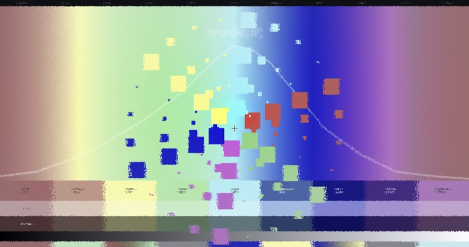
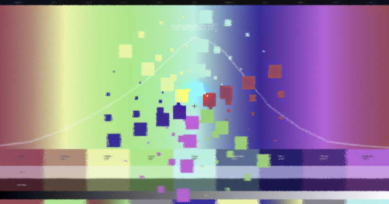
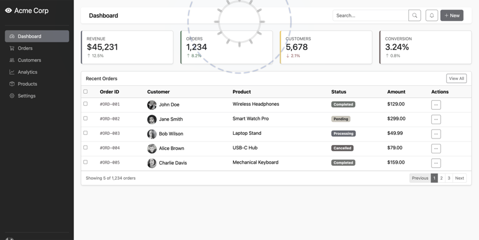
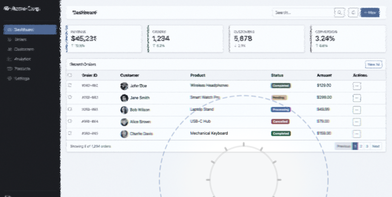
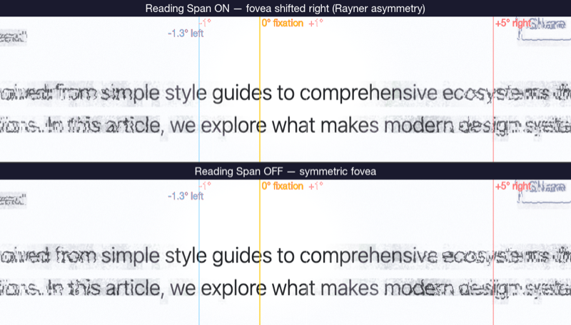
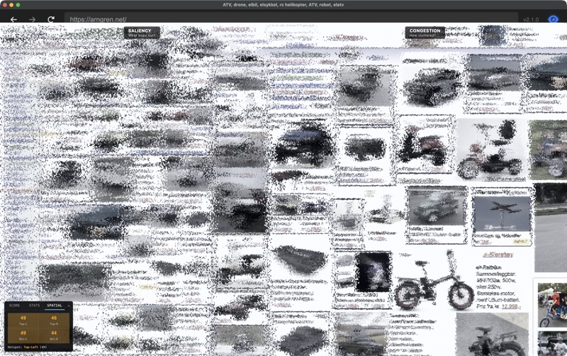
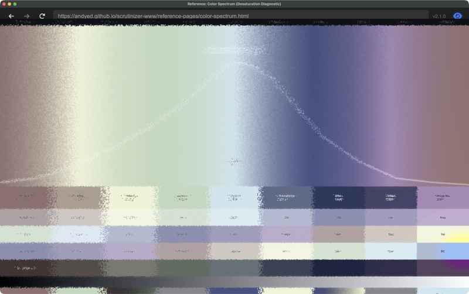
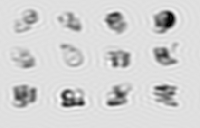
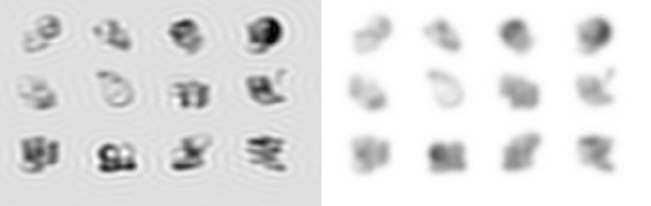
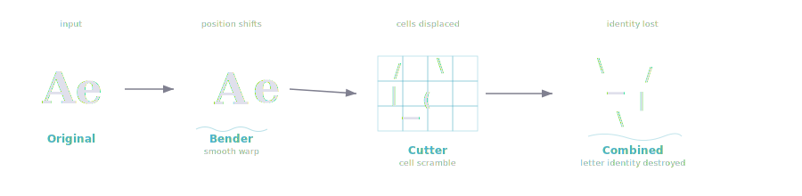

# muriel gallery

Worked examples from shipped projects that exemplify what muriel's channels produce. Each entry is a thumbnail + a link to the live post, with a one-line mapping to the muriel channel or pattern the image demonstrates. The goal is to make the abstract channel categories (raster, science, web, interactive) legible in fifteen seconds.

All linked sites are publicly published; source blog posts live under [the Scrutinizer dev log](https://andyed.github.io/scrutinizer-www/blog/). This gallery references them, it doesn't host them.

---

## 1. Before / after comparison panel — Raster

[](https://andyed.github.io/scrutinizer-www/blog/2026-03-16-color-sprint.html) [](https://andyed.github.io/scrutinizer-www/blog/2026-03-16-color-sprint.html)

**Channel:** [`channels/raster.md`](../../channels/raster.md) — side-by-side raster composition with Pillow.
**Pattern:** identical framing, variable stimulus — the canonical "small multiples" idiom applied to A/B visual testing.
**Live post:** [Color sprint (andyed.github.io/scrutinizer-www)](https://andyed.github.io/scrutinizer-www/blog/2026-03-16-color-sprint.html).

---

## 2. Mode comparison — Raster

[](https://andyed.github.io/scrutinizer-www/blog/2026-03-21-v2.6.html) [](https://andyed.github.io/scrutinizer-www/blog/2026-03-21-v2.6.html)

**Channel:** [`channels/raster.md`](../../channels/raster.md) — same stimulus, two processing modes.
**Pattern:** `typeset.py`-style template rendering, repeated across a parameter axis. Reach for this when you'd otherwise build a complex multi-series single chart.
**Live post:** [v2.6 release notes (andyed.github.io/scrutinizer-www)](https://andyed.github.io/scrutinizer-www/blog/2026-03-21-v2.6.html).

---

## 3. Reading-span A/B — Science

[](https://andyed.github.io/scrutinizer-www/blog/2026-03-13-reading-span.html)

**Channel:** [`channels/science.md`](../../channels/science.md) — matplotlib figure with APA-style stats, `matplotlibrc_dark` palette.
**Pattern:** paired-conditions comparison with labeled axes, effect size, and sample size — exactly what `muriel.stats.format_comparison()` formats into a caption.
**Live post:** [Reading span on/off (andyed.github.io/scrutinizer-www)](https://andyed.github.io/scrutinizer-www/blog/2026-03-13-reading-span.html).

---

## 4. Saliency vs. congestion — Science

[](https://andyed.github.io/scrutinizer-www/blog/congestion-score.html)

**Channel:** [`channels/science.md`](../../channels/science.md) — dense analytic visualization laying out multiple derived metrics against the source image.
**Pattern:** stacked small-multiples for visual diagnostic review. `muriel.dimensions.figsize_for('chi', columns=2)` sizes panels like this for academic venues.
**Live post:** [Congestion score (andyed.github.io/scrutinizer-www)](https://andyed.github.io/scrutinizer-www/blog/congestion-score.html).

---

## 5. Color foveation demo — Interactive → Raster

[](https://andyed.github.io/scrutinizer-www/blog/color-search.html)

**Channel:** [`channels/interactive.md`](../../channels/interactive.md) captured into [`channels/raster.md`](../../channels/raster.md).
**Pattern:** a live WebGL demo screenshotted at publishing-quality for inclusion in a blog post. The interactive version stays live; the raster snapshot goes into social cards and paper figures. `muriel.capture.capture_responsive` is the general form of this.
**Live post:** [Color search (andyed.github.io/scrutinizer-www)](https://andyed.github.io/scrutinizer-www/blog/color-search.html).

---

## 6. Icon analysis pair — Raster + SVG

[](https://andyed.github.io/scrutinizer-www/blog/color-search.html) [](https://andyed.github.io/scrutinizer-www/blog/color-search.html)

**Channel:** [`channels/raster.md`](../../channels/raster.md) for the pair; [`channels/svg.md`](../../channels/svg.md) for the accompanying diagrams in the post.
**Pattern:** micro-comparison at icon scale — two ~256-px tiles laid out inline in editorial prose. Useful when a full figure is overkill.

---

## 7. Warm editorial web page — Web

[](https://andyed.github.io/attentional-foraging/explainer/)

**Channel:** [`channels/web.md`](../../channels/web.md) — marginalia + warm editorial light palette.
**Pattern:** long-form explainer with pull-quotes, margin notes, inline stats spans, drop-cap. Matches the `muriel.matplotlibrc_light` palette at the figure level.
**Live page:** [Attentional Foraging F-pattern explainer (andyed.github.io)](https://andyed.github.io/attentional-foraging/explainer/).
**Note:** live and in active use; some supplementary sections are still in draft — the page ships but treat specific claims as provisional until the corresponding draft is lifted. (Replace this placeholder thumbnail with a real screenshot of the page hero.)

---

## Generating the dual-brand variant (TODO)

The gallery above points at shipped examples. The inverse — taking one brief and rendering it through two brand TOMLs to show `muriel.styleguide` in action — is the planned runnable demo. It'll land here as `dual-brand-figure.py` with output PNGs for `example-brand.toml` (OLED) and a second warm-editorial brand, once the schema supports distinguishing text-accent from decorative-accent.

## Refreshing thumbnails

All thumbnails live in [`thumbs/`](thumbs/). Originals came from `scrutinizer-www/src/blog/images/`; resized to 800px wide max and re-encoded as JPG (85% quality) for files above ~500 KB. If a blog post updates its hero image, re-run:

```bash
sips -Z 800 -s format jpeg -s formatOptions 85 source.png --out thumbs/source.jpg
```
