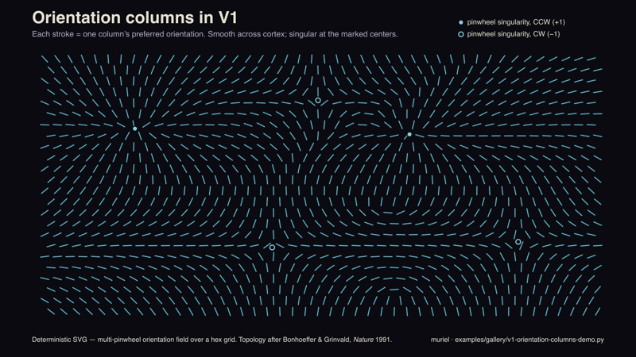

# muriel gallery

Worked examples from shipped projects that exemplify what muriel's channels produce. **Each entry leads with the tool chain** — which muriel helpers (and external libraries) produced the artifact. The goal is to make the abstract channel categories executable: if you want output like this, here's the exact recipe.

---

## 0. muriel's own hero mark — Raster + Kinetic Typography + Visible Language

<p align="center">
  <picture>
    <source srcset="../../assets/logo-animated-dark.gif" media="(prefers-color-scheme: dark)">
    
  </picture>
</p>

**Tools:** Pillow (still frame composition) · a custom 12-pose renderer (iterates frame_0..frame_11.png) · ffmpeg or ImageMagick `convert -delay -loop 0` (GIF assembly) · `muriel.contrast.audit_svg` (8:1 text-rule check before ship).
**Channels:** [`raster`](../../channels/raster.md), [`svg`](../../channels/svg.md), [`video`](../../channels/video.md).
**Vocabularies:** [`visible-language`](../../vocabularies/visible-language.md) (Cooper's mitp colophon reinterpreted), [`kinetic-typography`](../../vocabularies/kinetic-typography.md) (strategic motion, max contrast).
**Pattern:** same mark, four variants — still + animated × light + dark — served via `<picture>` + `prefers-color-scheme`. Assets at [`assets/`](../../assets/).

*The rest of the gallery points at other shipped work that exemplifies each channel in its own right. Source blog posts live under [the Scrutinizer dev log](https://andyed.github.io/scrutinizer-www/blog/); this gallery references them, it doesn't host them.*

---

## 1. Before / after comparison panel — Raster

[](https://andyed.github.io/scrutinizer-www/blog/2026-03-16-color-sprint.html) [](https://andyed.github.io/scrutinizer-www/blog/2026-03-16-color-sprint.html)

**Tools:** Pillow (image composition + draw) · matplotlib (curve overlay rendered as PNG, then composited) · [`muriel/typeset.py`](../../muriel/typeset.py) (caption typography) · [`muriel/contrast.py`](../../muriel/contrast.py) (pre-ship 8:1 audit).
**Channel:** [`channels/raster.md`](../../channels/raster.md).
**Pattern:** canonical small-multiples A/B — identical framing, variable stimulus.
**Live:** [Color sprint →](https://andyed.github.io/scrutinizer-www/blog/2026-03-16-color-sprint.html)

---

## 2. Mode comparison — Raster (interactive → captured)

[](https://andyed.github.io/scrutinizer-www/blog/2026-03-21-v2.6.html) [](https://andyed.github.io/scrutinizer-www/blog/2026-03-21-v2.6.html)

**Tools:** a WebGL foveation engine (external, Scrutinizer) for the rendering · [`muriel/capture.py`](../../muriel/capture.py) (`capture_responsive()` for retina screenshots) · Pillow (side-by-side composition) · [`muriel/dimensions.py`](../../muriel/dimensions.py) (`OG_CARD` for final size).
**Channel:** [`channels/raster.md`](../../channels/raster.md) (captured from [`channels/interactive.md`](../../channels/interactive.md)).
**Pattern:** same stimulus, two processing modes — small multiples across a parameter axis.
**Live:** [v2.6 release notes →](https://andyed.github.io/scrutinizer-www/blog/2026-03-21-v2.6.html)

---

## 3. Reading-span A/B — Science

[](https://andyed.github.io/scrutinizer-www/blog/2026-03-13-reading-span.html)

**Tools:** matplotlib (figure composition with two `subplot` panels, body-text rendering via `ax.text()` or imported image, degree-of-visual-angle guides as `axvline`) · [`muriel/matplotlibrc_dark.py`](../../muriel/matplotlibrc_dark.py) (palette + rcparams) · [`muriel/dimensions.py`](../../muriel/dimensions.py) (`figsize_for('chi', columns=2)`) · [`muriel/stats.py`](../../muriel/stats.py) (`format_comparison()` for the effect-size caption).
**Channel:** [`channels/science.md`](../../channels/science.md).
**Pattern:** paired-conditions comparison with labeled axes, effect size, and sample size — exactly what `muriel.stats.format_comparison()` formats into a figure caption.
**Live:** [Reading span on/off →](https://andyed.github.io/scrutinizer-www/blog/2026-03-13-reading-span.html)

---

## 4. Saliency vs. congestion — Science

[](https://andyed.github.io/scrutinizer-www/blog/congestion-score.html)

**Tools:** matplotlib (dense small-multiples grid, `GridSpec` or `subplot_mosaic`) · numpy / polars (derived metric computation) · [`muriel/matplotlibrc_dark.py`](../../muriel/matplotlibrc_dark.py) · [`muriel/dimensions.py`](../../muriel/dimensions.py) (`figsize_for('chi', columns=2)` for IEEE/CHI venue width).
**Channel:** [`channels/science.md`](../../channels/science.md).
**Pattern:** stacked small-multiples for visual diagnostic review — multiple derived metrics against one source image.
**Live:** [Congestion score →](https://andyed.github.io/scrutinizer-www/blog/congestion-score.html)

---

## 5. Color foveation demo — Interactive captured to Raster

[](https://andyed.github.io/scrutinizer-www/blog/color-search.html)

**Tools:** a live WebGL demo (external) for the interactive itself · [`muriel/capture.py`](../../muriel/capture.py) (`capture_responsive()` with retina scale factor) · Pillow (crop + composite for editorial placement) · [`muriel/contrast.py`](../../muriel/contrast.py) (audit for annotations).
**Channel:** [`channels/interactive.md`](../../channels/interactive.md) captured into [`channels/raster.md`](../../channels/raster.md).
**Pattern:** the live version stays interactive; the raster snapshot goes into social cards + paper figures.
**Live:** [Color search →](https://andyed.github.io/scrutinizer-www/blog/color-search.html)

---

## 6. Icon analysis pair — Raster + SVG

[](https://andyed.github.io/scrutinizer-www/blog/color-search.html) [](https://andyed.github.io/scrutinizer-www/blog/color-search.html)

**Tools:** Pillow (thumbnail resize + compositing) · a Gaussian-blur variant (Pillow's `ImageFilter.GaussianBlur`) · [`muriel/typeset.py`](../../muriel/typeset.py) (label typography) · SVG (hand-rolled or `svgwrite`) for accompanying diagrams in the post.
**Channels:** [`channels/raster.md`](../../channels/raster.md) + [`channels/svg.md`](../../channels/svg.md).
**Pattern:** micro-comparison at icon scale — two ~256-px tiles laid out inline in editorial prose. When a full figure is overkill.

---

## 7. V1 orientation columns — Diagrams + SVG (runnable)

[](../../docs/v1-orientation-columns.svg)

**Tools:** pure Python stdlib (`math`) emitting SVG directly — a multi-pinwheel orientation field over a hex grid, hand-rolled `<line>` + `<circle>` elements with brand tokens inlined from `examples/muriel-brand.toml` (OLED palette, 8:1+ contrast on every text element).
**Channels:** [`channels/diagrams.md`](../../channels/diagrams.md) + [`channels/svg.md`](../../channels/svg.md), with [`channels/science.md`](../../channels/science.md) sensibility (cited primary literature in the footer).
**Pattern:** deterministic SVG diagram replacing an AI-generated raster — every stroke is a function of position, the topology is reproducible, the file diff-able. Pinwheel singularities marked; one is annotated as a worked-example legend.
**Run:** `python examples/gallery/v1-orientation-columns-demo.py` → writes `docs/v1-orientation-columns.svg`.
**Why it's here:** the deterministic-SVG ethos in one file. Scientific basis: Hubel & Wiesel (1962) orientation selectivity; Bonhoeffer & Grinvald (*Nature* 1991) pinwheel topology.

---

## 8. Warm editorial web page — Web

[](https://andyed.github.io/attentional-foraging/explainer/)

**Tools:** marginalia (editorial CSS library, external) · `marginalia-md.js` (markdown → marginalia HTML in the browser) · a Node build script · custom CSS for the F-explainer's light palette extensions (`.outer-note`, `.stats-detail`, `.has-dropcap`) · [`muriel/matplotlibrc_light.py`](../../muriel/matplotlibrc_light.py) (for any inline figures to match the warm editorial palette).
**Channel:** [`channels/web.md`](../../channels/web.md) — marginalia + warm editorial light palette.
**Pattern:** long-form explainer with pull-quotes, margin notes, inline stats spans, drop-cap.
**Live:** [Attentional Foraging F-pattern explainer →](https://andyed.github.io/attentional-foraging/explainer/)
*Note: live and in active use; some supplementary sections are still in draft. Replace this placeholder thumbnail with a real screenshot of the page hero.*

---

## Refreshing thumbnails

All thumbnails live in [`thumbs/`](thumbs/). Resized to 800px wide max and re-encoded as JPG (85% quality) for files above ~500 KB. If a blog post updates its hero image, re-run:

```bash
sips -Z 800 -s format jpeg -s formatOptions 85 source.png --out thumbs/source.jpg
```

## Upcoming

The dual-brand runnable demo (same brief, two TOMLs, two PNGs side-by-side, exercising `muriel.styleguide` end-to-end) is the missing piece. Unblocked by the two-tier alias schema; scheduled for 0.6.0.
